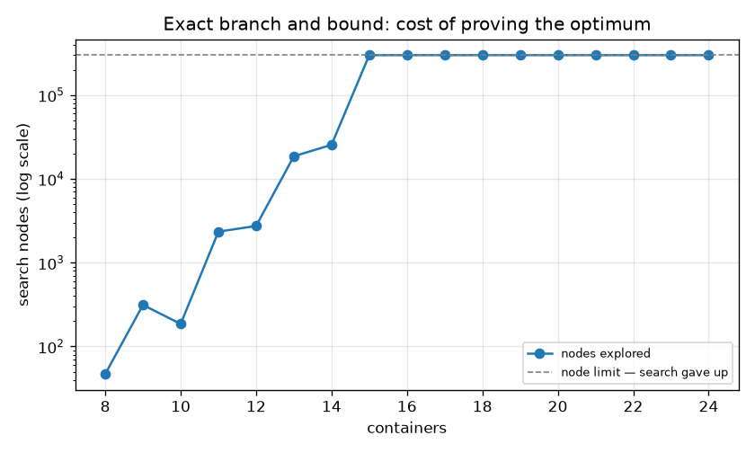
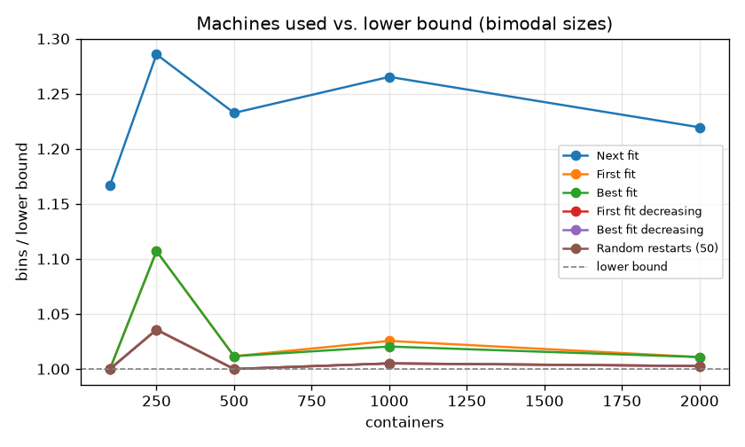
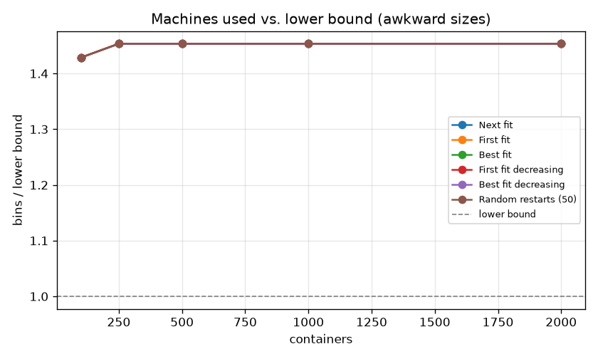
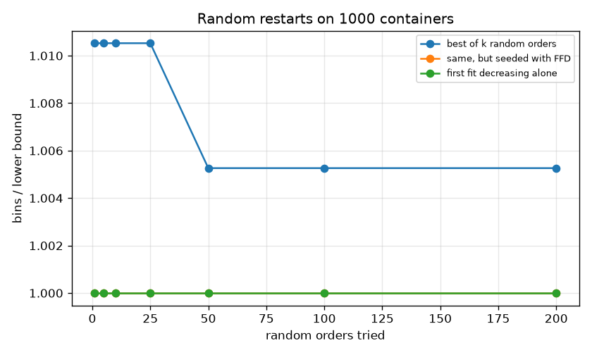

# Packing containers onto servers: what to do when the exact answer is out of reach


Fitting containers onto machines with fixed capacity is **bin packing**, which is NP-hard. There is no known algorithm that finds the optimal packing for a real fleet in reasonable time. This project measures what that actually costs you: how fast an exact solver dies, how close cheap greedy rules get, and how many dollars a month separate a careless rule from a good one.

## Key findings

| Question | Answer from the measurements |
|---|---|
| How far does an exact solver get? | It proves the optimum up to **14 containers**. At 15 it hits the search budget and gives up. Not a slow algorithm — an exponential one |
| Do the cheap rules get close? | On 16-container instances solved exactly, **first-fit-decreasing averaged 1.02× the optimum** and hit it exactly on 38 of 40 |
| Does sorting first matter? | Yes. FFD beat plain first fit on every distribution tested, and came within one machine of the lower bound on a 1,000-container fleet |
| Is random search worth it? | **No.** 200 random orders never beat one run of FFD. Randomness is not a substitute for structure |
| What does it cost? | On a 1,000-container fleet: next fit needs 218 machines, FFD needs 178. At $70/machine/month that's **$2,800 a month** |
| Does any rule survive a hostile input? | No. On sizes just over one third of capacity, every heuristic — and the optimum — sit 45% above the lower bound |

Full numbers: [`results/results.md`](results/results.md)

## Exact optimum: fine until it isn't



The solver is branch and bound with four prunings: start from the FFD answer as an upper bound, abandon any branch already using that many machines, never try a second empty bin or a bin whose load was already tried at this step (symmetry breaking), and stop as soon as the lower bound is reached.

Even with all that, the search explodes: 47 nodes at 8 containers, 25,496 at 14, and past the 300,000-node budget at 15. **That gap is the whole argument for heuristics.** A real fleet has thousands of containers.

## Greedy heuristics, and how close they get



| Heuristic | Rule | Worst-case guarantee |
|---|---|---|
| Next fit | One open machine; close it when the item doesn't fit | 2 × optimal |
| First fit | First machine with room | 1.7 × optimal |
| Best fit | Machine left with the least spare room | 1.7 × optimal |
| **First fit decreasing** | Sort largest first, then first fit | **(11/9) × optimal + 6/9** |

Sorting first is the entire difference between the 1.7 bound and the 1.22 bound: big items get placed while machines are still empty, and small ones fill the gaps. A test in `tests/` checks FFD against its guarantee on instances where the true optimum is known.

## When the measurement lies



On "awkward" instances — every container just over one third of a machine — every heuristic lands about 45% above the lower bound. That looks like failure, but only two containers can ever share a machine, so the true optimum is n/2 machines while the lower bound says n/3. **The heuristics are optimal here; the bound is loose.** A ratio against a bound is evidence, not proof.

## Does randomness help?



Best-of-k random orders through first fit (a Monte Carlo method: fixed budget, no guarantee). Going from 1 to 200 shuffles improved the packing once, and never caught FFD. Sorting is cheaper *and* better here.

## Layout

```
src/instances.py    three families of test instances, plus the L1 lower bound
src/heuristics.py   next fit, first fit, best fit, and the decreasing variants
src/exact.py        branch and bound with a node budget, so it fails loudly instead of hanging
src/randomized.py   best of k random orders
src/benchmarks.py   the five experiments, charts and results.md
tests/              28 tests, including FFD vs its proven bound and the solver vs brute force
```

## Run it

```bash
git clone https://github.com/munevvercoskun/bin-packing-lab.git
cd bin-packing-lab
python -m venv .venv
.venv\Scripts\activate          # Windows  (macOS/Linux: source .venv/bin/activate)
pip install -r requirements.txt

python -m pytest
python -m src.benchmarks         # regenerate charts + results.md
python -m src.benchmarks --quick
```

## What I took away

- **Recognizing NP-hardness is the practical skill.** The useful answer to "pack this optimally" isn't a cleverer search, it's: this is bin packing, here's a heuristic within a proven factor, and here's what the gap costs.
- **A worst-case bound and average behaviour are different things.** FFD's guarantee is 1.22×; it averaged 1.02× on random instances and was exactly optimal on the 1,000-container fleet.
- **Measure against something you understand.** The lower bound is cheap but loose, and the awkward instances show how a loose bound can make a perfect answer look 45% bad.
- **Structure beats brute force.** One sort did more than 200 random restarts.

## Where this shows up
Container and VM placement, warehouse loading, cutting stock, ad-slot filling, and sharding data across machines are all this problem. Kubernetes-style schedulers use greedy scoring for the same reason this project does.

## Built with
Python 3.12 · matplotlib · pytest · GitHub Actions
